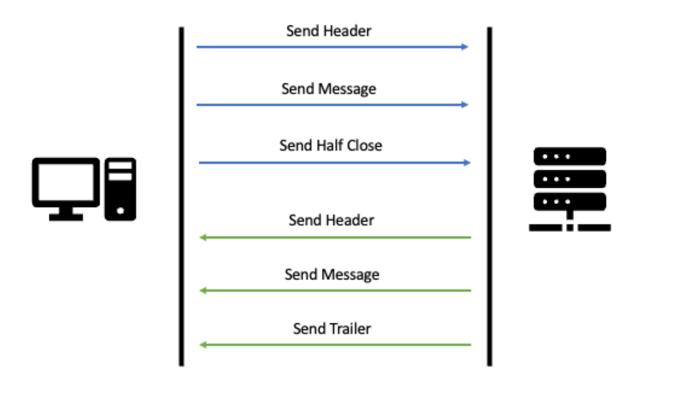
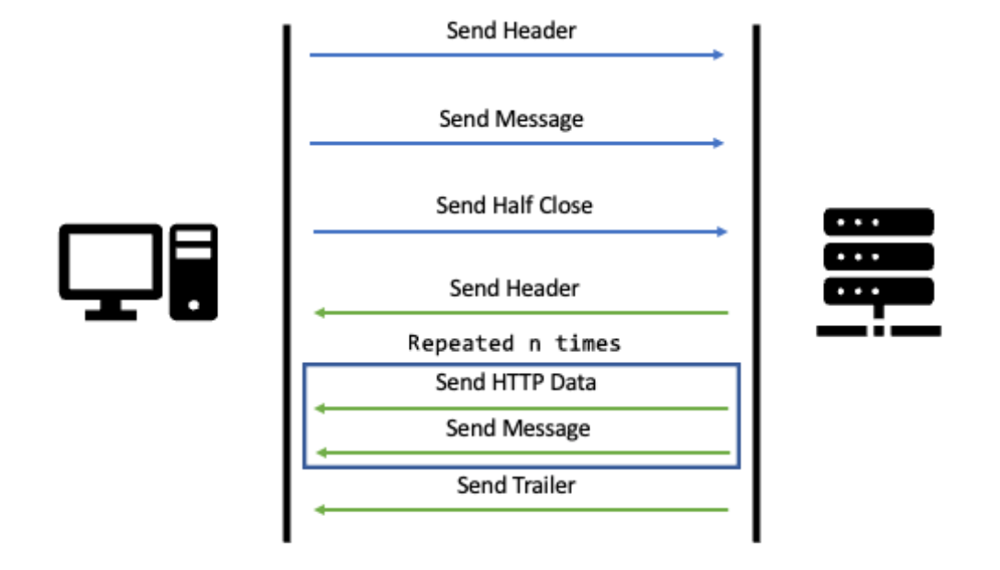
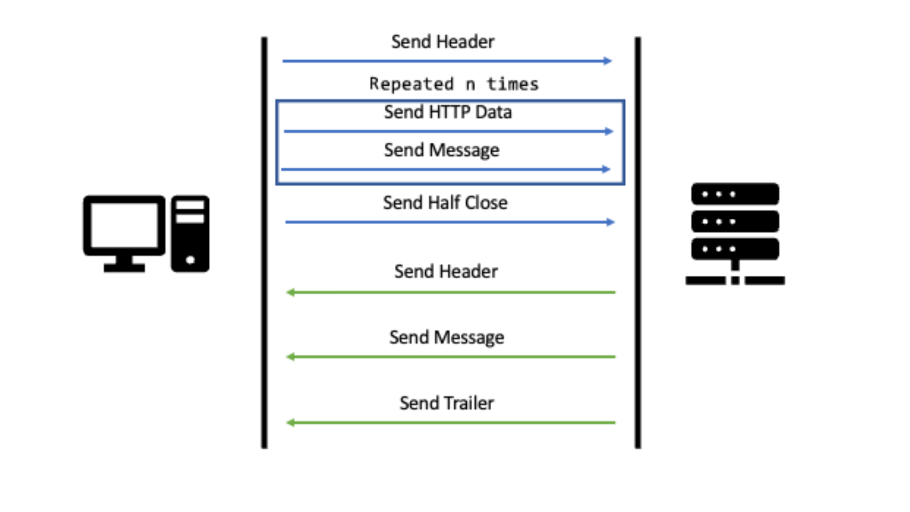
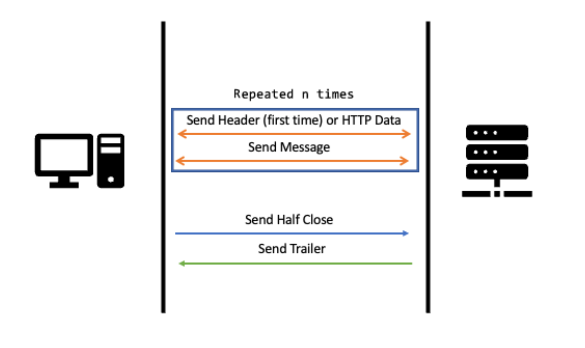
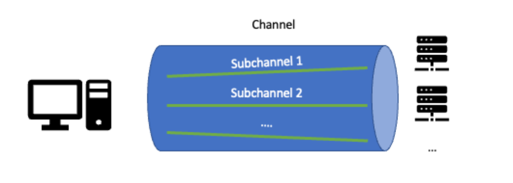
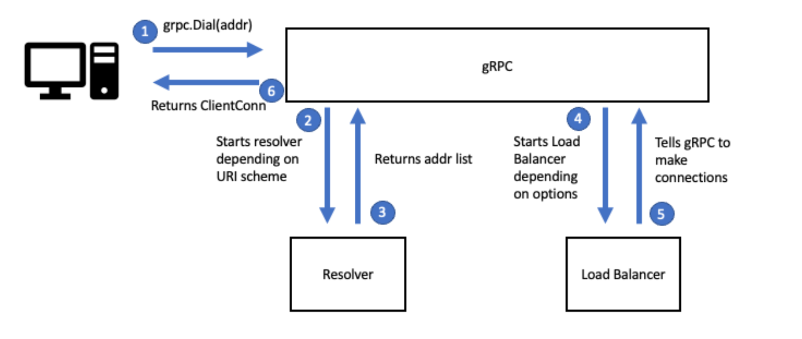

## Intro
- gRPC is one of the high-level frameworks that we can use to achieve efficient reception and transmission of data.
- sending and receiving data without thinking about all the things that could go wrong

HTTP/1.1 -> Traditional HTTP API calls
HTTP/2 -> still has same concepts but improves efficiency, security, and usability:
- Feature called `server push`: gives the ability to send multiple responses for only one call from the client.
- `Long-lived TCP connection` instead of individual connections per request.
  - Traditionally, every call is preceded by the creation of a TCP connection and succeeded by the closing of that connection. This is highly inefficient for today’s use of the internet.
  - In HTTP/2, single long-lived connection that can handle multiple requests and responses as interleaved packets.

### 📝
> We mostly need to understand that in HTTP/2, we can send structured binary messages over the wire instead of text, we can have streams where the server can send multiple responses for one response, and finally, we do that in an efficient way because we only create one TCP connection and it will handle multiple requests and responses.

*P.S.:* gRPC has its own communication protocol on top of HTTP/2

## RCP Operations
### Send Header
A switch between the server and the client to let both sides know who needs to read and who needs to write.
```
HyperText Transfer Protocol 2
  Stream: HEADERS, Stream ID: 1, Length 67, POST
    /greet.GreetService/Greet
    Flags: 0x04, End Headers
      00.0 ..0. = Unused: 0x00
      ..0. .... = Priority: False
      .... 0... = Padded: False
      .... .1.. = End Headers: True
      .... ...0 = End Stream: False
    Header: :method: POST
    Header: content-type: application/grpc
```
*sent by the client in order to let the server know that it will send a request*

```
HyperText Transfer Protocol 2
  Stream: HEADERS, Stream ID: 1, Length 14, 200 OK
    Flags: 0x04, End Headers
      00.0 ..0. = Unused: 0x00
      ..0. .... = Priority: False
      .... 0... = Padded: False
      .... .1.. = End Headers: True
      .... ...0 = End Stream: False
    Header: :status: 200 OK
    Header: content-type: application/grpc
```
*sent by the server to let the client know that it will send the response*

### Send Message
Sends the actual data. After sending the header, the client can send a message as a request and the server can send a message as a response.

```
GRPC Message: /greet.GreetService/Greet, Request
  0... .... = Frame Type: Data (0)
  .... ...0 = Compressed Flag: Not Compressed (0)
  Message Length: 9
  Message Data: 9 bytes
Protocol Buffers: /greet.GreetService/Greet,request
  Message: <UNKNOWN> Message Type
    Field(1):
      [Field Name: <UNKNOWN>]
      .000 1... = Field Number: 1
      .... .010 = Wire Type: Length-delimited (2)
      Value Length: 7
      Value: 436c656d656e74
```
*data (simplified) being sent by the client as a request*

```
GRPC Message: /greet.GreetService/Greet, Response
  0... .... = Frame Type: Data (0)
  .... ...0 = Compressed Flag: Not Compressed (0)
  Message Length: 15
  Message Data: 15 bytes
Protocol Buffers: /greet.GreetService/Greet,response
  Message: <UNKNOWN> Message Type
    Field(1):
      [Field Name: <UNKNOWN>]
      .000 1... = Field Number: 1
      .... .010 = Wire Type: Length-delimited (2)
      Value Length: 13
      Value: 48656c6c6f20436c656d656e74
```
*data (simplified) sent by the server as a response*

### Send Half Close
- Closes either the input or the output of an actor.
- When the client is done sending the request, sending a Half Close closes the client stream.
- A little bit like Send Header in the sense that it is acting as a switch to let the server know that it is time to work.

```
HyperText Transfer Protocol 2
  Stream: DATA, Stream ID: 1, Length 14
    Length: 14
    Type: DATA (0)
    Flags: 0x01, End Stream
      0000 .00. = Unused: 0x00
      .... 0... = Padded: False
      .... ...1 = End Stream: True
```
*notice the flag that denotes the end of the request.*

> Notice however that here, we are sending a payload of type DATA, because DATA is much lighter than a header. This is used for the Half Close because we simply want to send a boolean

### Send Trailer
Terminates an entire RPC. Also gives us more information about the call, such as the status code, error message, and so on.
```
HyperText Transfer Protocol 2
  Stream: HEADERS, Stream ID: 1, Length 24
    Length: 24
    Type: HEADERS (1)
    Flags: 0x05, End Headers, End Stream
      00.0 ..0. = Unused: 0x00
      ..0. .... = Priority: False
      .... 0... = Padded: False
      .... .1.. = End Headers: True
      .... ...1 = End Stream: True
    Header: grpc-status: 0
    Header: grpc-message:
```
*Note that the trailer is basically a header*

## RPC types

### Unary
A unary RPC is an RPC that performs one request and returns one response.


### Server Streaming
A server streaming RPC is an RPC that performs one request and returns one or more responses.



- Useful for situations where the client is expecting to get updates from the server.
- The client could subscribe and the server could send different stock prices over time.

```
HyperText Transfer Protocol 2
  Stream: DATA, Stream ID: 1, Length 30
    Length: 30
    Type: DATA (0)
    Flags: 0x00
      0000 .00. = Unused: 0x00
      .... 0... = Padded: False
      .... ...0 = End Stream: False
```

### Client Streaming
A client streaming RPC is similar to server streaming, but this time, the client can send one or more
requests and the server returns one response.
- Useful when sending real-time information to the server.




### Bidirectional Streaming
Mix of server streaming and client streaming. A client can send one or more requests and the server returns one or more responses.
- Less predictable;
- There is no defined order;




## Life Cycle of an RPC

> gRPC has multiple implementations in different languages. The original one was in C++ and some implementations are just wrappers around the C++ code. However, gRPC Go is a standalone implementation. This means that it was implemented from scratch in Go and doesn’t wrap up the C++ code. As such, in this section, we are going to talk specifically about gRPC Go, and this might prove to be implemented differently in other implementations.

- We interact with only a few points of the gRPC API;
- Transport -> The manager of the connection between the actors and it sends/receives raw bytes over the network.


*This represents a code being both a server and a client. Sending messages and reading responses.*

### The connection
- `Dial` create a connection.
- `dns://` by default.
- gRPC will create a load balancer based on the configuration:
  - It has two load balancers as default:
    1. **Pick first** -> connects to the first address it can connect to, and sends all the RPCs to it;
    2. **Round robin** -> connects to all the addresses and sends an RPC to each backend one at a time and in order



The connection brings two more abstractions:
- **Channel** -> It's a list of addresses, abstraction for the connection used by RPCs;
- **Subchannel** -> Abstractions for connections that the load balancer can use to direct the data to one or more backends


