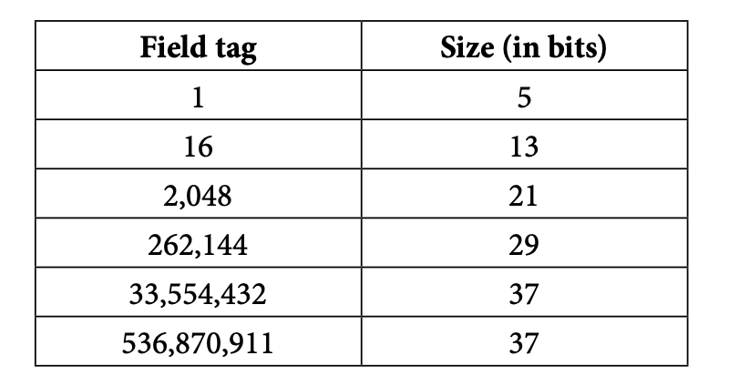

# Protocol Buffers (Protobuf)
- It's a language (IDL - Interface Description Language)
  - Writes data schemas / contracts
- Encodes into binary
- Serialization and deserialization of messages
  - The goal of serialization is to store data, generally in a more compact or readable representation.
  - Deserialization is the process of reading the binary created earlier and populating the data back into an object in your favorite programming language;

> Install the protobuf compiler and test with `protoc --version`.

```protobuf
syntax = "proto3";

enum AccountRight {
  ACCOUNT_RIGHT_UNSPECIFIED = 0;
  ACCOUNT_RIGHT_READ = 1;
  ACCOUNT_RIGHT_READ_WRITE = 2;
  ACCOUNT_RIGHT_ADMIN = 3;
}

message Account {
  uint64 id = 1;
  string username = 2;
  AccountRight right = 3;
}
```

## Protobuf vs JSON
JSON is by far the most popular data schema, let's break down pros and cons by category.

### Serialized data size:
- The lighter the payload, the faster it should arrive;
- Protobuf is the clear winner against JSON;
- This is the case because JSON serializes to text whereas Protobuf serializes to binary and thus has more room to improve how compact the serialized data is;

Example:
```json
{ id: 123 }
```
*json representation*


```bash
cat ${INPUT_FILE_NAME}.txt | protoc --encode=${MESSAGE_NAME} ${PROTO_FILE_NAME}.proto | hexdump –C
cat account.txt | protoc --encode=Account account.proto | hexdump -C
```
*to serialize the example*

```
00000000 08 7b |.{|
00000002
```
*outputs*

### Readability
Regarding the schema:
- Protobuf can contain comments;
- Has explicit types;

About the serialized schema:
- JSON is the clear winner;
- If you need human-readable data that can be edited by hand, Protobuf is not the right fit;

### Schema strictness
On protobuf:
- Schemas are always valid ones because every field has an explicit type;
- This is enforced in the generated code by either runtime checks for dynamic languages or at compile time;


## Encoding details
**Fixed size numbers** -> `fixed32`, `fixed64`, `sfixed32`, `sfixed64`, `float`, `double`
**Varints** -> `int32`, `int64`, `uint32`, `uint64`, `bool`
**Length delimited** -> `string`, `bytes`

- `fixed32` and `fixed64` are unsigned numbers. This means that we cannot store negative numbers in fields with these types. `sfixed32` and `sfixed64` solve that.
- `float` is encoded into 4 bytes while `double` is encoded into 8 bytes.
- On `varints`, the bigger the number the bigger the larger the number of bytes.

## Field tags and Wire types
You surely noticed something different about the syntax of a field. Each time we define a field, we add an equals sign and then an incrementing number:
```protobuf
uint64 id = 1;
```

*Their purpose is to give a unique identifier to the field.* These are called `tags`. They are important for serialization. The field name is not serialized only the type and tag are.

Tags are simply serialized as varints but they are serialized with a wire type. A wire type is a number that is given to a group of types in Protobuf. Here is the list:

| Type | Meaning | Used for |
|------|---------|----------|
| 0    | Varint  | int32, int64, uint32, uint64, sint32, sint64, bool, enum |
| 1    | 64 bits | fixed64, sfixed64, double |
| 2    | Length delimited | string, bytes, packed repeated fields |
| 5    | 32 bits  | fixed32, sfixed32, float |

- Protobuf uses a concept called bit packing
- The last 3 bits of the serialized metadata are reserved for the wire type

For example, a serialized 42 in a fixed32:
```
0d 2a 00 00 00
```
0d would be the metadata, in binary would be:
```
00001101
```
101 is the wire type, which equals `5`. The rest of the bits are reserved for the tag.
Since the tag can grow, we need to be mindful about their bytes allocation:



- Keep the lowest tags to the fields that are the most often populated will lower the overhead needed to store the metadata.
- You can always consider moving a group of data into a new message with lower tags.
